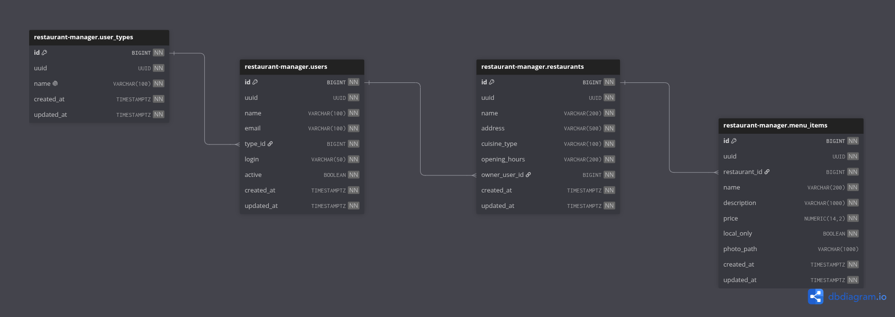
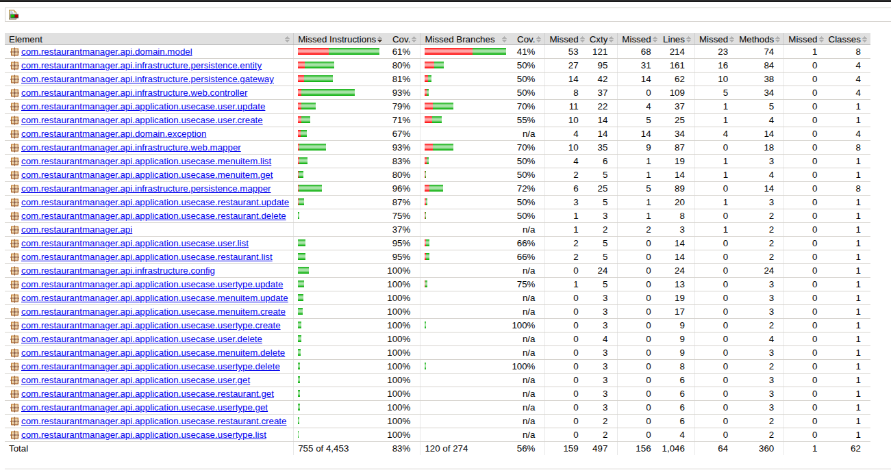

# Restaurant Manager

Sistema de gestão para restaurantes desenvolvido como Tech Challenge da fase 2, com foco em uma arquitetura Spring Boot contract-first, Clean Architecture, PostgreSQL e Flyway.

## Descrição do projeto

> TECH CHALLENGE
>
> O Tech Challenge é o projeto que englobará os conhecimentos obtidos em todas as disciplinas da fase. Esta é uma atividade que, em princípio, deve ser desenvolvida em grupo. Importante atentar-se ao prazo de entrega, pois trata-se de uma atividade obrigatória, uma vez que vale pontos na composição da nota final.
>
> O problema
>
> Na nossa região, um grupo de restaurantes decidiu contratar estudantes para construir um sistema de gestão para seus estabelecimentos. Essa decisão foi motivada pelo alto custo de sistemas individuais, o que levou os restaurantes a se unirem para desenvolver um sistema único e compartilhado.
>
> Esse sistema permitirá que os clientes escolham restaurantes com base na comida oferecida, em vez de se basearem na qualidade do sistema de gestão.
>
> O objetivo é criar um sistema robusto que permita a todos os restaurantes gerenciar eficientemente suas operações, enquanto os clientes poderão consultar informações, deixar avaliações e fazer pedidos online.
>
> Devido à limitação de recursos financeiros, foi acordado que a entrega do sistema será realizada em fases, garantindo que cada etapa seja desenvolvida de forma cuidadosa e eficaz.
>
> A divisão em fases possibilitará uma implementação gradual e controlada, permitindo ajustes e melhorias contínuas conforme o sistema for sendo utilizado e avaliado tanto pelos restaurantes quanto pelos clientes.

## Stack

- Java 21
- Spring Boot 3.5.x
- Spring Web, Spring Data JPA e Validation
- Flyway
- PostgreSQL
- OpenAPI Generator
- Docker e Docker Compose

## Arquitetura - Clean Architecture


## Diagrama de banco de dados



## Cobertura de testes



## Como funciona o contract first

Este projeto usa o arquivo OpenAPI como fonte de verdade para a API:

- contrato principal: `src/main/resources/openapi/restaurant-manager-api.yaml`
- o `pom.xml` configura o `openapi-generator-maven-plugin`
- as interfaces e modelos gerados são usados pela aplicação
- a implementação deve seguir o contrato, e não o contrário

### Fluxo recomendado

1. Atualize o contrato em `src/main/resources/openapi/restaurant-manager-api.yaml`
2. Gere os artefatos com Maven
3. Implemente os controllers, use cases e adapters seguindo as interfaces geradas
4. Valide com testes

### Gerar código a partir do contrato

```bash
./mvnw clean generate-sources
```

Se preferir, também é possível executar uma compilação completa:

```bash
./mvnw clean compile
```

## Execução com Docker

> Antes de subir a aplicação, renomeie o arquivo `.env.sample` para `.env` e ajuste as variáveis conforme o seu ambiente.

### Subir a aplicação e o banco

```bash
docker compose up -d --build
```

### Verificar os containers

```bash
docker compose ps
```

### Acompanhar os logs

```bash
docker compose logs -f restaurant-manager-api
```

### Parar os serviços

```bash
docker compose down
```

## Comandos básicos de compilação

```bash
./mvnw clean compile
./mvnw clean package -DskipTests
```

## Testes

### Executar a suíte de testes

```bash
./mvnw test
```

### Executar os testes com build completo

```bash
./mvnw clean test
```

### Executar os testes com cobertura de código

```bash
mvn clean test jacoco:report
```

## Endpoints úteis

- Health check: `GET /actuator/health`
- Documentação OpenAPI: `GET /v3/api-docs`
- Swagger UI: `GET /swagger-ui.html`

## Collection Postman

[postman_collection_restaurant_manager.json](docs/postman_collection_restaurant_manager.json)

## Variáveis de ambiente principais

- `SERVER_PORT`
- `DB_HOST`
- `DB_USERNAME`
- `DB_PASSWORD`
- `JPA_SHOW_SQL`

## Estrutura resumida

- `src/main/java/` - código-fonte da aplicação
- `src/main/resources/application.yaml` - configuração do Spring Boot
- `src/main/resources/openapi/restaurant-manager-api.yaml` - contrato da API
- `src/main/resources/db/migration/` - migrações do Flyway
- `docker-compose.yml` - ambiente local com PostgreSQL e aplicação

## Observações

- O banco de dados usa o schema `restaurant-manager`.
- O projeto implementa Clean Architecture, separando domínio, aplicação e infraestrutura.
